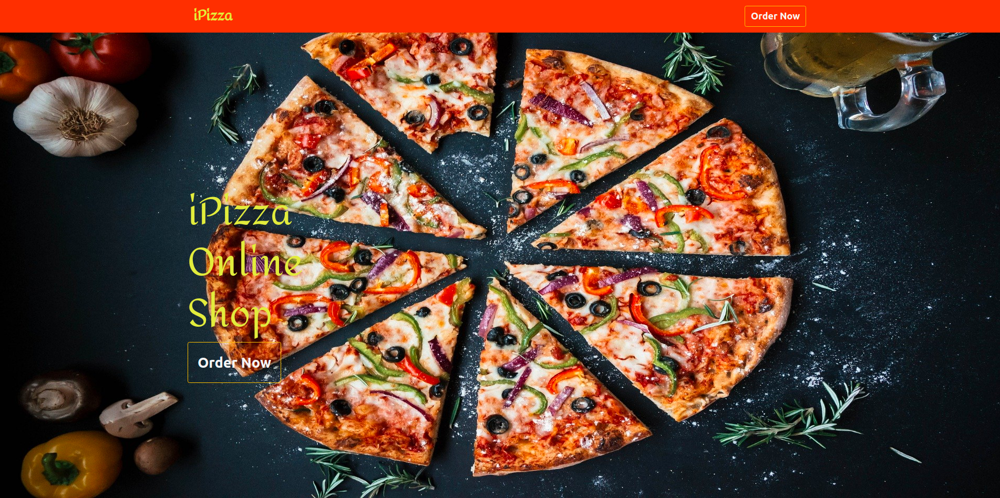
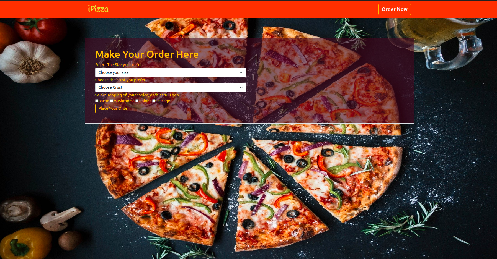
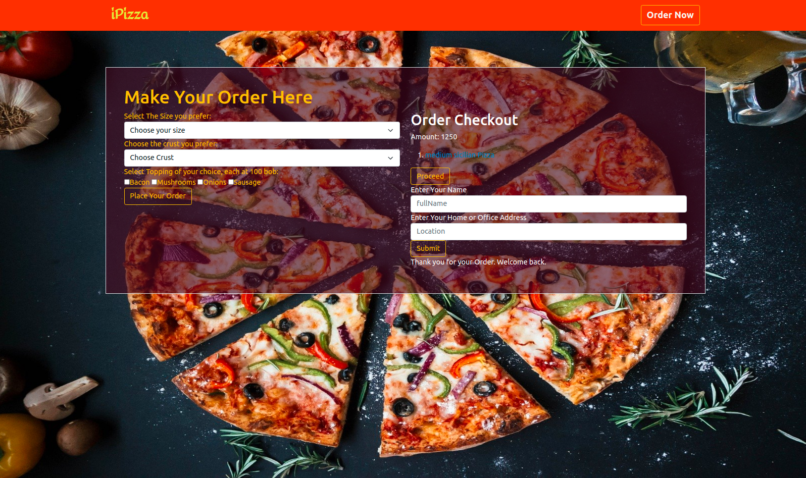
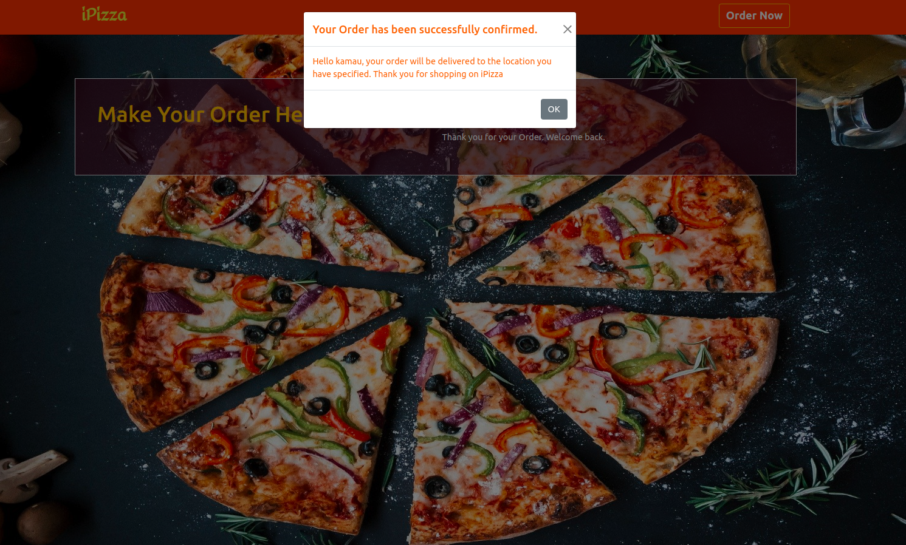

# ipizza Shop!

[Check it out]()

## Description:

It is a web application for ordering pizza online.

## Author:

> Kinoti Gitonga

## Screenshot:

## Setup:

`git clone https://github.com/ikinoti/iPizza-shop` or download the zip file

Extract the zip file

`cd` project folder

`launch` the index.html file

## Technologies:

- HTML5
- CSS3
- Bootstrap
- Javascript
- Jquery

## BDD:

| Behaviour                            | Input                           |                   Output |
| :----------------------------------- | ------------------------------- | -----------------------: |
| Select pizza size                    | Select from options provided    |                          |
| Select pizza crust                   | select from option provided     |                          |
| Select toppings                      | select from the option provided |                          |
| Checkout the order                   |                                 | Order is being processed |
| choose to pick up or delivery option | Enter your details              |

## License:

> MIT LICENSE &copy; 2021

## Collaborate:

To contribute to iPizza Project!, reach me on `isaiah.gitonga@student.moringaschool.com`.
